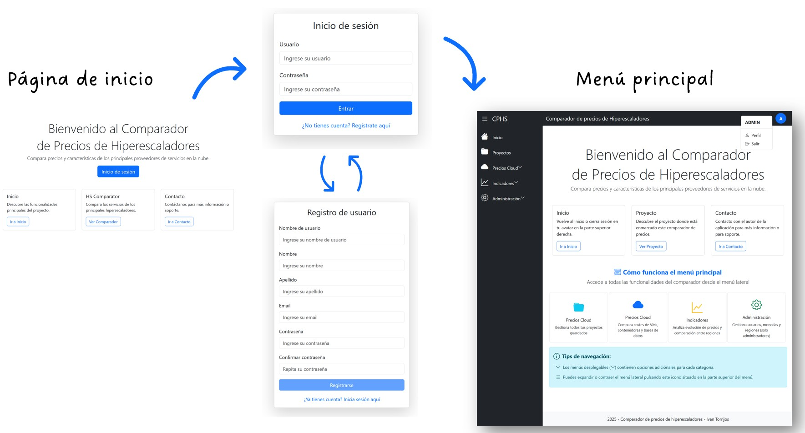
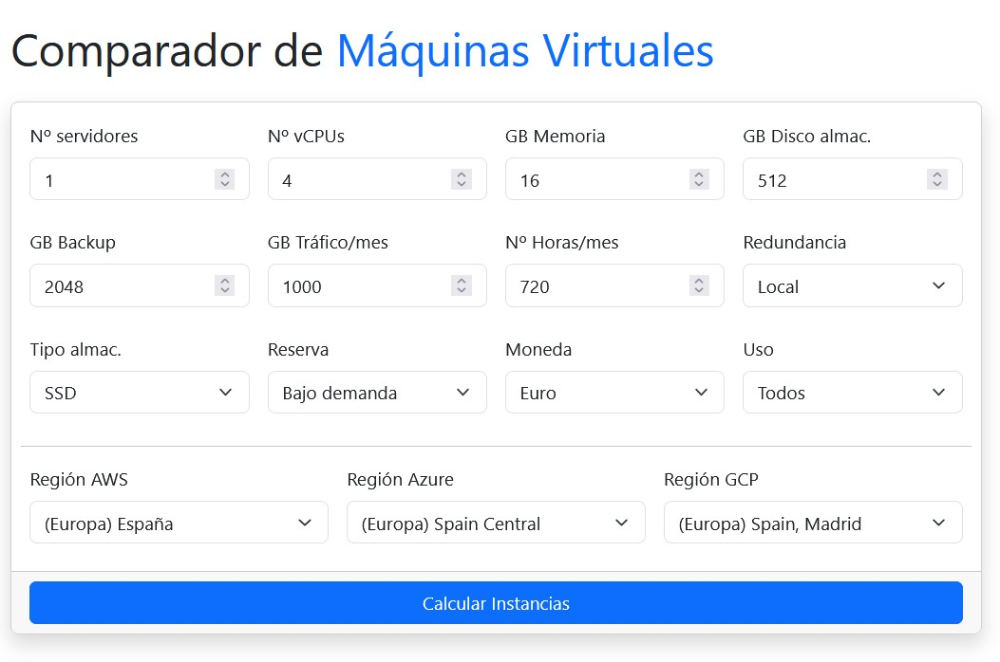
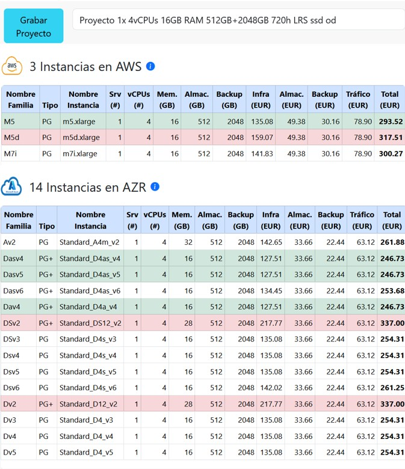
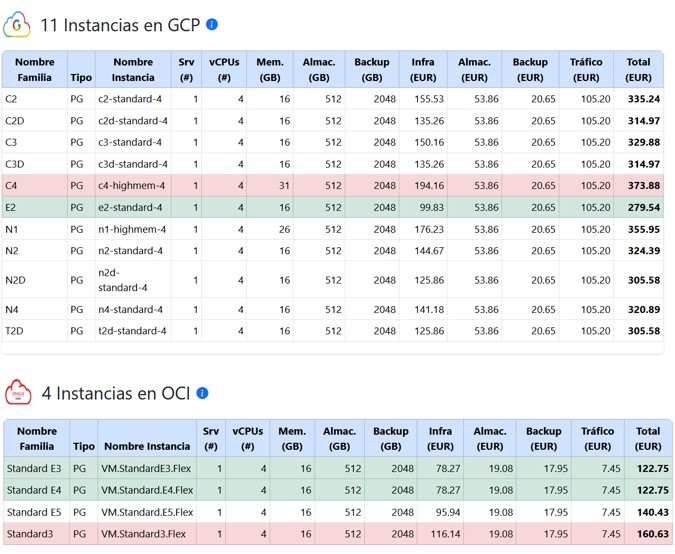
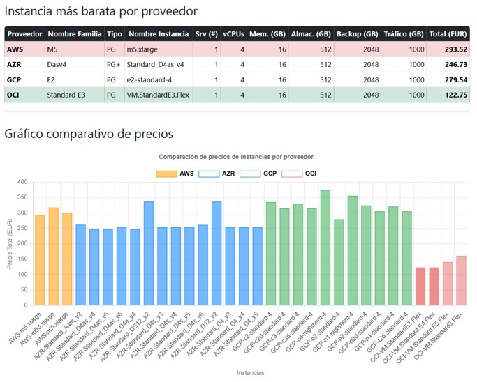
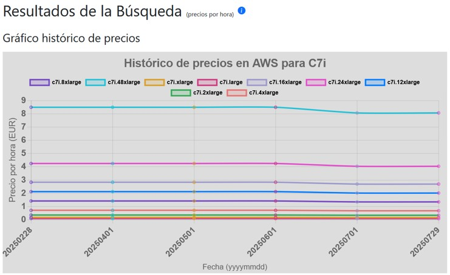

# CompareHSPrices

Comparador de precios de Hiperescaladores

Este proyecto contiene la interfaz web de usuario y la API de consulta de precios de los proveedores cloud AWS, Azure,
GCP y OCI almacenados previamente.
Está enfocado en los precios de instancias dedicadas de máquinas virtuales, contenedores Kubernetes y servicios de base
de datos en instancias dedicadas.

Este repositorio complementa al capturador de precios de hiperescaladores disponible
en https://github.com/Ivantg01/ScraperHSPrices

## Capturas de pantalla interfaz web

</img>
</img>
</img>
</img>
</img>
</img>

## Herramientas usadas:

Nota: utiliza Bootstrap 5 compilado y descargado en local para funcionar https://getbootstrap.com
